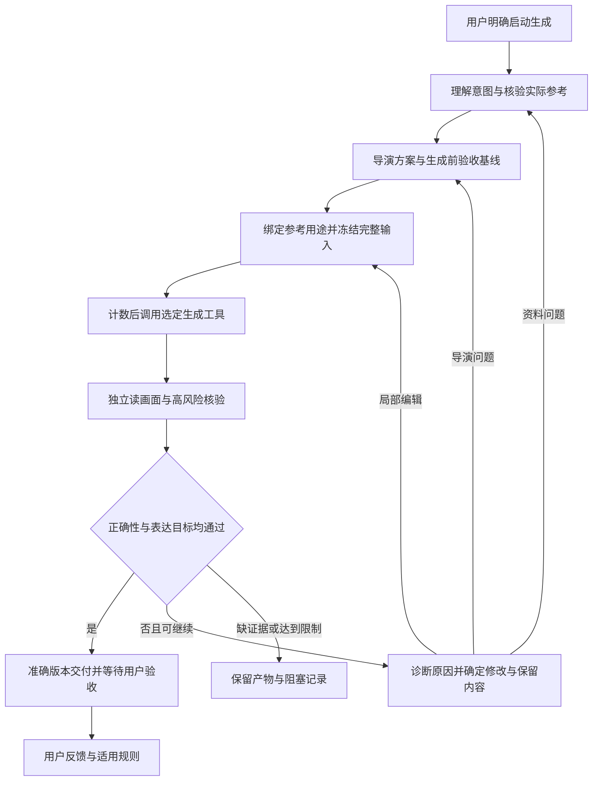

# aniGC

由 Codex 主导的图片生成、监修与迭代工作框架。它将“生成 → 检查实际图片 → 记录问题 → 修改输入 → 再生成”组织为可追溯的任务，保存每轮输入、原图、监修报告和用户验收记录。

Codex 根据工作流 skill 判断资料和画面；Python 工具执行文件保存、请求计数、生成 API 调用、版本检查和恢复。当前没有独立运行的自动视觉评审模型，也不以生成模型的自评作为通过依据。

## 当前能力

| 能力 | 状态 |
| --- | --- |
| 图片工作流 skill 与七类 Markdown 模板 | 已实现；含导演方案、固定验收边界、参考分工与修改诊断 |
| 任务、轮次、不可覆盖的输入/产物与 Markdown 预览 | 已实现 |
| 新任务／新批次默认六次请求；失败、未知请求与恢复计数 | 已实现 |
| Gemini / Nano Banana 生成及基于底图的语义编辑适配器 | 已实现，有离线测试与真实返回图片验证 |
| 逐图监修登记、最终版本校验、独立用户验收 | 已实现；视觉判断由 Codex 执行 |
| 历史反馈规则 | 已有本地记录与人工索引流程；自动检索待实现 |
| GPT Images API 生成、多参考图与语义编辑 | 已实现；支持型号与参数校验、独立凭据、多参考图和结果收录；账号可用性需自行核验 |
| Clip Studio | 尚未接入 |
| 真实生成质量与监修效果 | 已有首批复盘；质量改进仍待后续任务验证 |



## 环境与离线检查

- Python 3.10 或更新版本；运行代码只依赖标准库。
- 支持 macOS 和提供 `fcntl` 文件锁的 Linux；暂不支持原生 Windows 文件锁。
- 在 Codex 中使用时，仓库 skill 位于 `.agents/skills/image-workflow/`。

```sh
git clone https://github.com/ISCT-W/aniGC.git
cd aniGC
PYTHONPATH=src python3 -m anigc --help
PYTHONPATH=src python3 -m anigc backends
PYTHONPATH=src python3 -m unittest discover -s tests -v
```

这些检查不需要 API key，不发送生成请求；测试数据写入临时目录。

## 本地配置

参考 [.env.example](.env.example) 配置本地 `.env`，并按 [AGENTS.example.md](AGENTS.example.md) 建立本地工作约定。已有文件请保留，不直接覆盖。

| 配置 | 用途 |
| --- | --- |
| `GEMINI_API_KEY` | Gemini 凭据，也兼容 `GOOGLE_API_KEY`；仅真实调用需要 |
| `GEMINI_IMAGE_MODEL` | 独立图像模型配置；显式 `--model` 优先，均未设置时使用代码默认型号 |
| `GPT_API_KEY` | GPT Images API 凭据；不回退到其他服务的 key |
| `GPT_IMAGE_MODEL` | GPT API 型号；显式 `--model` 优先，未配置时不自动选择 |
| `ANIGC_REFERENCE_PROJECT_ID` | 正式任务唯一允许的参考项目；未配置时拒绝创建正式任务 |


离线任务使用 `offline-fixture` 模拟项目，不读取真实项目配置。正式任务记录创建时的项目，恢复时核对当前配置，不会因更换配置而改写旧任务。

参考资料可以由 Codex 通过用户配置的只读 MCP 取得，再保存为任务所需的参考基线。仓库不分发任何公司服务配置、客户项目、角色资料或访问凭据，也不包含通用 MCP 客户端。实际工具及图文可读性需在使用环境中核验。

## 一次任务怎样运行

1. 用户明确启动生成，Codex 保存原始请求和授权，确认角色版本、参考项目与交付要求。
2. 读取实际资料及适用历史反馈，分别核实身份、动作、特效与环境。Codex 将自然语言要求编排为单一故事瞬间、观看重点、逐人动作/视线/接触关系，并检查展示尺度与主要风险；无需用户先写专业分镜。
3. 在参考基线中固定严格保持、允许变化和表达目标，逐张绑定参考的对象、版本、控制特征及禁止迁移内容。关键证据不足先补证；不能生成后因失败次数而降低用户要求。
4. `prepare` 保存本轮输入，`check-request` 离线校验。API 使用 `submission.md` 中的精确文字，说明性记录保存在 `prompt.md`。
5. Gemini / GPT API 使用 `generate --execute --evidence-ready` 预留次数并发送一次请求；不隐藏重试。
6. Codex 先描述实际画面，再核对对象归属、接触关系、动作方向及关键配件等高风险内容，完成适用的全图检查；正确性与表达效果分别结论，再用 `review` 登记。
7. 需要修改时记录“问题 → 原因假设与依据 → 改什么 → 保留什么 → 修复判据”。资料问题先补证，导演问题重做方案，局部问题优先选择合适历史底图编辑；整体重生成须说明原因，禁止无诊断重复抽样。
8. `promote` 将准确通过版本复制到 `final_output/`；`accept` 记录用户对该版本的明确意见。

完整参数与示例见 [本地工具](docs/local-tools.md) 和 [生成后端](docs/generation-backends.md)。`recover` 核对已有状态；响应已完整暂存时用 `collect` 恢复收录，两者均不重新生成。未知请求可能需要人工核实，不能保证自动取回丢失的远端响应。

## 质量流程的职责与限制

| 产物 | 保存位置 | 负责的问题 |
| --- | --- | --- |
| 导演方案 | prompt.md | 如何将意图变成可读的单一画面 |
| 验收基线与参考分工 | reference.md；prompt.md 输入表 | 哪些必须保持、允许怎样变化、每张图控制谁 |
| 证据监修与修改决策 | review.md；下一轮 prompt.md | 实际哪里不符、依据是什么、下一轮怎样修且避免退化 |

这些阶段由 Codex 按 skill 执行；程序只保护记录、预算和版本，不会自动判断导演方案或图像质量。固定商品的姿势和结构须保持，场景人物的姿态按创作范围设计；透视、光影和材质变化不能成为改造商品或省略关键细节的理由。字段填齐、离线测试通过均不等于画质提高。

MCP 结构化监修点尚未接入，具体方案留白；当前使用已查看资料和人工整理的 R/C 基线，不依赖该能力。此次修改过程与验证范围见 [质量工作流改进记录](docs/image-quality-improvement-plan.md)。

## 可追溯记录

```text
generations/<时间戳>-<任务名>-<工具>/             # 本地数据，不提交
  README.md                    # 状态、次数与轮次预览
  brief.md                     # 用户原始要求
  authorization-001.md          # 本批授权
  state.json                   # 少量必要恢复状态
  feedback.md                  # 用户原话及规则关联
  references/reference.md      # 来源、约束与资料缺口
  rounds/001/
    prompt.md                  # 本轮完整输入记录
    submission.md              # 精确提交文字（API）
    settings.md                # 模型、图片顺序与参数
    reference.md               # 当时的参考基线
    inputs/                    # 实际输入图片副本
    execution.md
    response.md
    output-01.png
    review.md
  final_output/                # 仅 Agent 监修通过版本
    final-v001-01.png
    acceptance.md              # Agent 与用户两级验收
```

文件校验可以发现输入、图片或报告变化，不能证明视觉质量。`--evidence-ready`、监修结论和授权原话由执行者确认；程序不独立理解用户意图或验证角色事实。

## 阅读与扩展

- [架构](docs/architecture.md)：职责、资料、反馈与后端边界。
- [工作流 skill](.agents/skills/image-workflow/SKILL.md)：生成、监修、恢复及反馈操作。
- [后端契约](src/anigc/backends/types.py)：独立的图片请求与返回类型。
- [生成执行器](src/anigc/generation.py)：共用验证、计数与保存流程。
- [任务记录](src/anigc/task_store.py)：文件、恢复和交付约束。

新增 API 后端可实现 `validate`、`generate` 并在后端注册表登记。桌面绘画应保留原生可编辑工程和逐轮导出图，其操作流程与预算需单独设计。

## 发布范围

公开仓库只包含通用代码、离线测试、skill、模板和使用说明。`.gitignore` 默认排除本地 `AGENTS.md`、凭据、内部调查、真实任务、反馈规则和缓存；只允许指定的通用文档进入版本控制。新增文件发布前仍需检查实际暂存内容，不能将 ignore 当作内容脱敏器。
